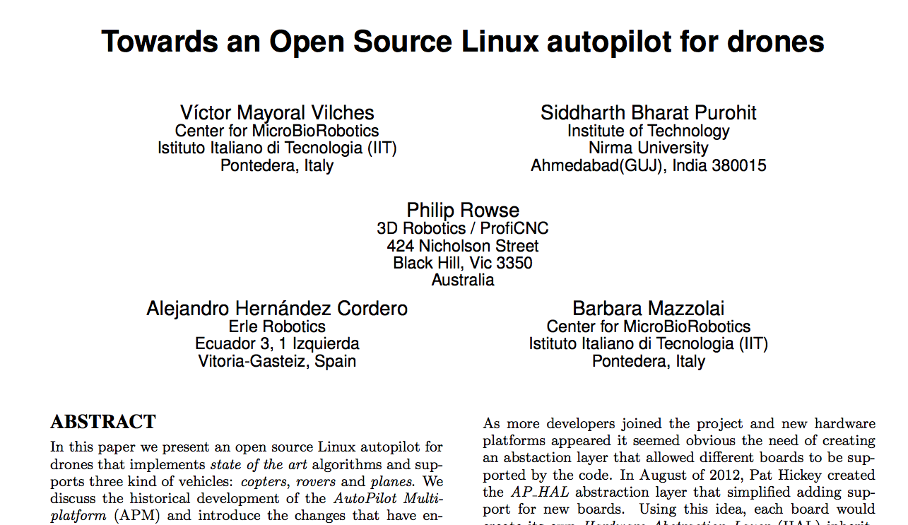

BeaglePilot:
=============

BeaglePilot project aims to create the first Linux-based autopilot for flying robots using the BeagleBone and the BeagleBone Black as the "hardware blueprint". For this purpose the project will focus on integrating ArduPilot (most popular autopilot) in the BeagleBone (Black). 

The conclusion of this work is presented in a final publication: [Towards an Open Source Linux autopilot for drones](files/APM-paper.pdf) accepted at [LibreCon 2014](http://www.libresoftwareworldconference.com/):



How to cite our work
-------------

##### Conventional citation
```
V. Mayoral,  S. Bharat, P. Rowse, A. Hernández, B. Mazzolai. "Towards an open sourcelinux autopilot for drones". "LibreCon 2014", 10 2014.
```

##### BibTex format
```
@conference{paperconf,
  author       = {V\'{i}ctor Mayoral Vilches, Siddharth Bharat Purohit, Philip Rowse, Alejandro Hernández Cordero, Barbara Mazzolai}, 
  title        = {Towards an Open Source Linux autopilot for drones},
  year         = 2014,
  month        = 10,
  organization = {LibreCon 2014},
}

```

##### Comments
We'd be happy to address any comments. Please submit a [new issue](https://github.com/BeaglePilot/beaglepilot/issues/new).


----

18th of August 2014, first flight with BeaglePilot with a Plane, performed in Australia by Andrew Tridgell.

----

Status
------

The following table sumarizes the *driver development status*. Feel free to grab one and help us further develop this:

| Milestone | Status |
| ----------|--------|
| ArduPilot running in the BBB (I2C connected sensors) | Ok |
| Device Tree for the PXF | WIP |
| MPU6000 SPI userspace driver | Ok |
| MPU9150 I2C userspace driver | Ok|
| LSM9DS0 SPI userspace driver | Coded |
| MPU9250 SPI userspace driver | Coded |
| MS5611 I2C/SPI userspace driver | Ok |
| GPIO userspace driver | Ok |
| I2CDriver multi-bus aware | WIP |
| AP_InertialSensor_Linux | ToDo |
| PRU PWM driver | Ok ([issue](https://groups.google.com/forum/#!topic/beaglepilot/7DKcdm0AEPo) with the PREEMPT_RT kernel) |
| MPU6000 SPI kernel driver | WIP |
| MPU9150 I2C kernel driver | ToDo |
| LSM9DS0 SPI kernel driver | ToDo |
| MPU9250 SPI kernel driver | ToDo |
| MS5611 I2C/SPI kernel driver | WIP |


*Status: `Ok`, `Coded` (needs test), `WIP` (work in progress), `Issue`, `ToDo`*

GSOC Frame:
-------------

| Timeline | Anuj Deshpande| Siddharth Bharat Purohit| Víctor Mayoral Vilches |
|----------|-------------- |-------------------------|------------------------|
| **Community Bonding** (21st April - 19th May 4 weeks)|Have already begun interacting with the community on ardupilot-discuss, #beaglepilot.Would be possible to being working in the “community bonding” period. | Coding started and trying to pull the timeline as up as possible leaving voids to do more :)| Already started coding and the discussion at #beaglepilot (Freenode). The mentors provided great feedback and tutorials to get started. The goal will be to get familiar with ArduPilot and start coding drivers (userspace ones at the beginning) for the hardware to be used (PixHawk Fire Cape). |
| May 19th - May 25th |Device tree generation. Create a test script to check if all pins required have been initialised to their appropriate modes.  | use beaglebone pru driver lib to upload firmware using remotproc| Hardware drivers coding (userspace) over the ArduPilot code (Linux kernel with RT_PREEMPT patches applied). |
| May 26th - June 1st | PPM & PWM generation| Create data handling library for PRU0, PRU1 and ARM| Hardware drivers coding. |
| June 2nd - June 8th | PPM & PWM generation | " | Code of hw tests. Make sure that all the hardware interfaces properly.| 
| June 9th - June 15th | PPM & PWM generation | Port Starterware Library to PRU| Realtime comparison: stock kernel userspace vs RT_PREEMPT kernel userspace (desirable to include tests with Xenomai if the time allows it) |
| June 16th - June 22nd | PPM & PWM generation | "| ROS integration through MAVLink (using mavlink_ros ROS package). This first task is expected to be straightforward.|
| June 23rd - June 29th |Mid-Term evaluations | "| (**Midterm Eval**) ROS bridge coded directly in the ArduPilot code as an optional module. |
| June 30th - July 6th | PPM-SUM |Create driver library (along with firmware) for Pixhawk Firecape sensors(PRU side) | ROS bridge coded directly in the ArduPilot code as an optional module.|
| July 7th - July 13th | PPM-SUM | "| ROS-Ardupilot tests. |
| July 14th - July 20th | SPI using the PRU | Create driver library for Pixhawk Firecape sensors(ARM side) i.e. Ardupilot AP_HAL compatible| IDE integration, web programming. Probably Codiad or Cloud9 (http://erlerobot.com/blog/programming-a-flying-robot-in-the-browser/). |
| July 21st - July 27th | SPI using the PRU |Intensive testing of Pixhawk Firecape with Ardupilot ported | Security review of Ardupilot running on a RT_PREEMPT patched kernel.|
| July 28th - August 3rd | GCS | Final housekeeping| Security issues. |
| August 4th - August 10th | GCS |Live Test and Documentation | Overall review an tutorials development. |
| August 11th - August 18th | Final evaluations |Live Test and Documentation | Wrap-up, documentation and delivery. |

Test Platforms:
-----------
BeaglePilot is currently being tested using the following drones:
- [Erle Robot](http://erlerobot.com)
- BeagleBone Black + PixHawk Fire Cape


Acknowledgements
---------
This work would not have been possible without the support of many people such as Kevin Hester, Lorenz Meier, Ben Nizette, Jimmy Johnson and Daniel Frenzel. Special thanks to the APM developers and particularly to Andrew Tridgell which has been our main source of  support and guidance. We would also like to metion the fantastic support offered by Beagleboard.org developers Jason Kridner, Pantelis Antoniou and their community. The authors would also like to convey thanks to  Beagleboard.org, Google, 3DRobotics and Erle Robotics for providing financial means and material. 


Communication & Resources:
--------------
- IRC Freenode #beaglepilot ([logs](http://logs.nslu2-linux.org/livelogs/beaglepilot/))
- [BeaglePilot mailing list](https://groups.google.com/forum/#!forum/beaglepilot)
- [eLinux Wiki](http://elinux.org/BeagleBoard/GSoC/BeaglePilot)
- [BeagleBoard project page](http://beagleboard.org/project/BeaglePilot/)
- [ArduPilot Wiki](http://dev.ardupilot.com/wiki/beaglepilot/)
- [BeaglePilot Blog](http://ardupilotbeaglebone.wordpress.com/)

[](https://kiwiirc.com/client/chat.freenode.net/?nick=beaglepilo|?#beaglepilot)
